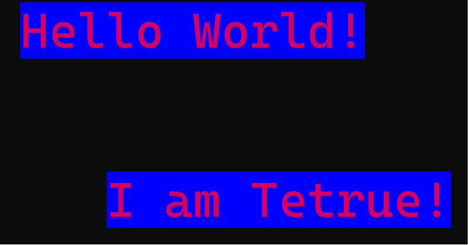

# Color & Styling

---

## Foreground and background colors

Every character drawn by the Terminal has a foreground color and a background color. Newly drawn text uses whatever colors are currently active. At the start, this is usually default, set by the Terminal or application.

The `Terminal` provides two methods for changing these colors: `setFg()` and `setBg()`.

You can specify a color in two ways. You can either pass RGB values, such as `setFg(255, 0, 0)`, or use `TextColor`.

`TextColor` is simply a helper class that provides a collection of predefined colors.

In the following example, we apply a blue background and a custom foreground color.

```java
terminal.setBg(TextColor.BLUE);
terminal.setFg(215, 35, 80);

terminal.put(0, 0, "Hello World!");
terminal.put(3, 3, "I am Tetrue!");

terminal.reset();
terminal.flush();
```

Terminal output:



---

## Text attributes (SGRs)

In addition to colors, Terminals support text attributes called **Select Graphic Rendition (SGR)**. These control how text is displayed, such as making it bold, underlined, italic, or reversed.

Colors control what color the text is displayed with, while SGR attributes control how the text is rendered.

Enable an attribute with `onSGR()` and disable it with `offSGR()`.

Some `SGR` attributes depend on Terminal support. If an attribute is unsupported, the Terminal may ignore it.

Multiple SGR attributes can be enabled at the same time. Calling `offSGR()` only disables the specified attribute, while `reset()` clears all colors and text attributes.

```java
terminal.onSGR(SGR.ITALIC);
terminal.onSGR(SGR.UNDERLINE);

terminal.put(0, 0, "Important!");

terminal.offSGR(SGR.UNDERLINE);

terminal.put(0, 1, "Still italic!");

terminal.reset();
terminal.flush();
```

Terminal output:


For the complete list of supported SGR values, see the [API Reference](../api-reference.md).

---

## Combining colors and attributes

Because colors and text attributes are part of the Terminal's current drawing state, they can be freely combined and changed between `put()` calls.

```java
terminal.setFg(TextColor.WHITE);
terminal.setBg(TextColor.BLUE);
terminal.onSGR(SGR.BOLD);
terminal.onSGR(SGR.UNDERLINE);

terminal.put(0, 0, "Warning!");

terminal.offSGR(SGR.BOLD);
terminal.offSGR(SGR.UNDERLINE);
terminal.onSGR(SGR.STRIKETHROUGH);

terminal.put(1, 1, "Less!");

terminal.setBg(TextColor.DARKGREY);
terminal.offSGR(SGR.STRIKETHROUGH);
terminal.onSGR(SGR.ITALIC);

terminal.put(2, 2, "Example!");
terminal.reset();
terminal.flush();
```

Terminal output:


---

## Stateful styling

Styling methods modify the Terminal's current drawing state. Every `put()` uses the current foreground color, background color, and text attributes until `reset()` is called.

This is why earlier examples always called `reset()` after changing colors or text attributes.

In this example, we call `reset()` after each styled `put()`. As a result, the final `put()` uses the Terminal's default colors and text attributes.

```java
terminal.setBg(TextColor.WHITE);
terminal.setFg(TextColor.DARKGREY);

terminal.onSGR(SGR.BOLD);

terminal.put(0, 0, "Hello!");
terminal.reset();

terminal.setBg(TextColor.GREEN);
terminal.setFg(32, 50, 100);

terminal.put(1, 1, "Hi!");
terminal.reset();

// This put call should now be default
terminal.put(2, 2, "Wazzup?");
terminal.flush();
```

Terminal output:


---

## Stateless styling

Stateful styling is convenient when drawing many pieces of text with the same appearance. However, if you only want to style a single `put()` call, or reuse the attributes across different parts of the application, `Style` is usually the better choice.

Unlike `setFg()`, `setBg()`, and `onSGR()`, using a `Style` does not modify the Terminal's current drawing state.

Because `Style` objects are immutable, they can be stored as constants, shared safely, and reused throughout your application.

In this example, we inline the `Style` directly into the `put()` method.

```java
terminal.put(0, 0, "Hello World!", Style.DEFAULT.bg(TextColor.BLUE).underline());
terminal.put(3, 3, "I should have default styles!");
// We no longer need to call `reset()`
terminal.flush();
```

Terminal output:


You can also store reusable styles in a `Config` class. This is useful for styles that are used throughout your application, such as error or success messages.

```java
public class Config {
    public static final Style ERROR_STYLE = Style.DEFAULT.fg(TextColor.RED).bg(TextColor.WHITE).underline().bold();
    public static final Style SUCCESS_STYLE = Style.DEFAULT.fg(TextColor.GREEN).bg(TextColor.WHITE).bold();
}

public class Main {
    public static void main(String[] args) {
        terminal.put(0, 0, "An error happened!", Config.ERROR_STYLE);
        terminal.put(0, 3, "Oh no, another error happened!", Config.ERROR_STYLE);
        terminal.put(3, 5, "Success!", Config.SUCCESS_STYLE);
        terminal.flush();
    }
}
```

Terminal output:


---

[Previous](reading-input.md){ .md-button }
[Advanced](../advanced/introduction.md){ .md-button }
